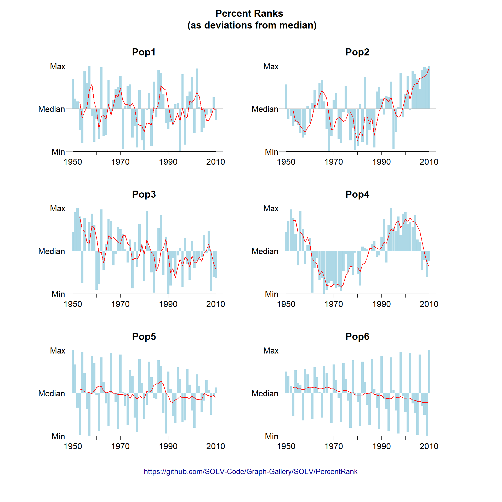
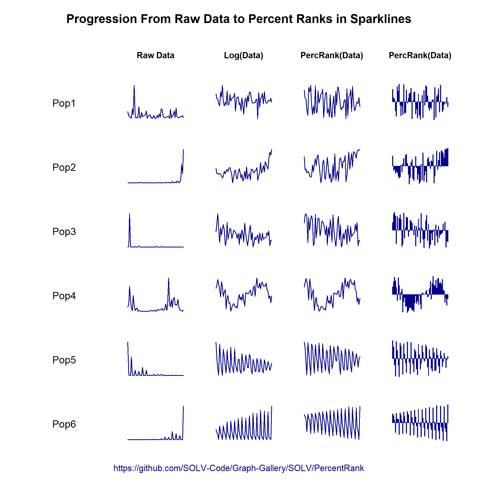

## Instructions for Contributors

### How to Contribute
* [Clone](https://help.github.com/articles/cloning-a-repository/) or [fork](https://help.github.com/articles/fork-a-repo/) the repository
* In your local copy, add a named folder
* In your named folder, create 1 subfolder for each plot you want to add
* In the plot folder, include a *.png file with the plot and a *.R with the code to generate the plot, as well as any required data files as *.csv.
* Add a brief blurb and a link to the *.png file in this README.md file, using the same template as the existing examples below.
* Commit your changes and push them to the repository using [Git Bash](https://dont-be-afraid-to-commit.readthedocs.io/en/latest/git/commandlinegit.html) or
[a Git GUI](https://git-scm.com/book/en/v2/Appendix-A%3A-Git-in-Other-Environments-Graphical-Interfaces)

## Gallery

### Trajectories

#### Percent Rank Transformation

Some text

### Boxplots

### Trade-off Plots

